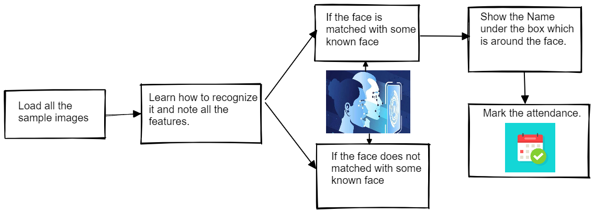
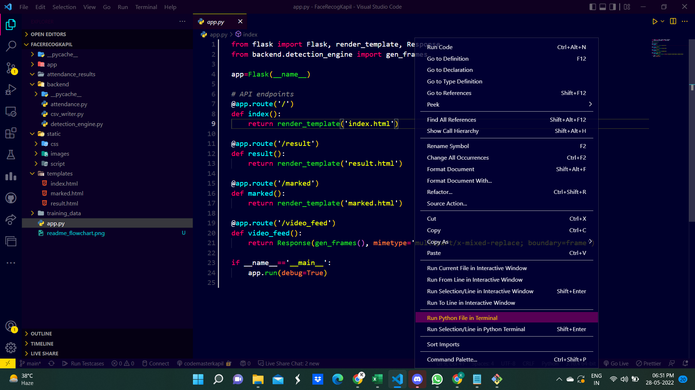
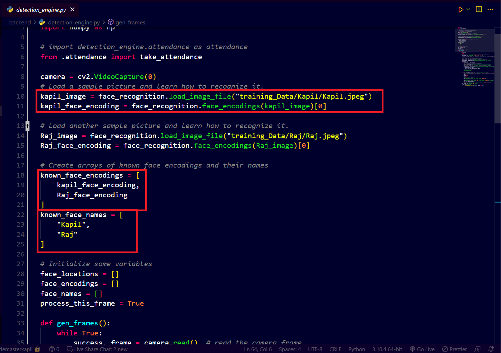

# smart_attendance_system



## Pre-requisites

- Flask
- Face_Recognition
- OpenCV

## Commands to setup the project

To install flask

```
pip install flask
```

To install face_recognition - [Refer to this video](https://youtu.be/xaDJ5xnc8dc)

To install opencv

```
pip install opencv-python
```

To install numpy

```
pip install numpy
```

#### Note : To run the project, run the app.py in terminal



## Steps to set it up, to recognise your face

- Add your image in the training dataset.
- Go to [detection_engine.py](https://github.com/codemasterkapil/smart_attendance_system/blob/main/backend/detection_engine.py)
- Replicate the below hilighted code in line number 10 and 11, and the location of your image accordingly.
- Then add your created variable to the **known_face_encodings** List.
- Then add your actual name to the **known_face_names** List.
- Then run the application as mentioned above and enjoy the process ☺️.



## Getting Started with docker commands

`docker run <image-name>` - Runs a Docker container from a specified image.
`docker images` - Lists all the Docker images that are available on your system.
`docker ps` - Shows all the running containers on your system.
`docker stop` <container-name> - Stops a running Docker container.
`docker rm` <container-name> - Removes a stopped Docker container.
`docker rmi` <image-name> - Removes a Docker image from your system.
`docker pull` <image-name> - Pulls a Docker image from a remote repository.
`docker login` - Logs in to a Docker registry so you can push and pull Docker images.
